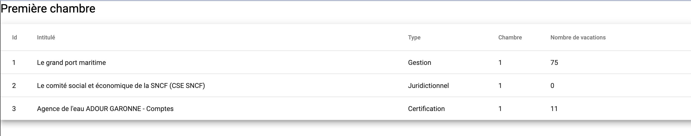

# ProgJF Test

## Description

L'exercice est de récupérer pour la première chambre les contrôles et leurs nombres de vacation. Le résultat à
afficher est le tableau de l'image présente à la racine du projet (ecran.jpg). La trame principale du projet est déjà
fournie. Le tableau et les colonnes existent déjà, il faut simplement les remplir avec la donnée. Il est possible de
modifier l'existant.



Le but de l'exercice est de mettre en place des bonnes pratiques de code et de nous expliquer dans les commentaires ou
dans un fichier markdown les décisions techniques prises (Pourquoi avoir pris telle décision, quelles autres options ont
été considérées etc)

Pour récupérer les données :

- Créer une api REST avec Django / Django Rest Framework : une trame de l'api : [Server](http://localhost:3000)
- Consommer cette API avec Angular et afficher les données dans le tableau

## Installation

```shell
npm install
```

## Lancer Angular et le serveur

```shell
npm run serve:all
```

- [Server](http://localhost:3000)
- [Client](http://localhost:4200)

